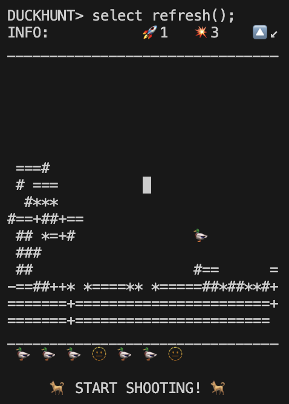

# Duck Hunt in SQL

## Gameplay

1. Install the game by running `./play.sh`.
2. Start a new game by running `select start()`. Optionally, `select start(2)` to start at a higher level.
3. Stop the game by running `select stop()` and exit by running `exit`.
4. Look at your `INFO` bar: `INFO:           🚀1   💥2    🔼↘`. This says Level 1, 2 shots left for this duck, and the direction that the duck is flying is bottom right. Your crosshair is a block `█` that starts in the center of a 16x16 grid. Your target is the duck 🦆 at the bottom of the grid. Now take aim at where the duck *might* be flying to and run (e.g.) `select shoot(-1,2)`. This will shoot at a position that is 1 left and 2 down from the current position. Your crosshair remains at this location now for the next shot.
5. If you've been inactive, or just need a refresh, run `select refresh()` to see the current position of the duck.
6. Once you run out of shots, the duck escapes. If you hit the duck, you score a point. Your score is at the bottom of the screen, and looks something like ` 🫥  🦆 🦆 🦆 🦆 🫥 `.
7. The outcome of the current shot is shown at the bottom each time you shoot.
8. Good luck, try to get all the 10 ducks in a game!

## Pre-requisites

1. Docker
2. Basic Math skills
3. Zen
